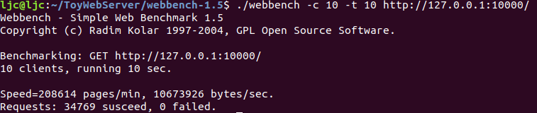
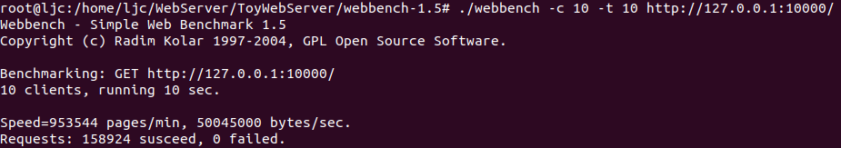
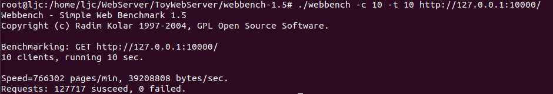
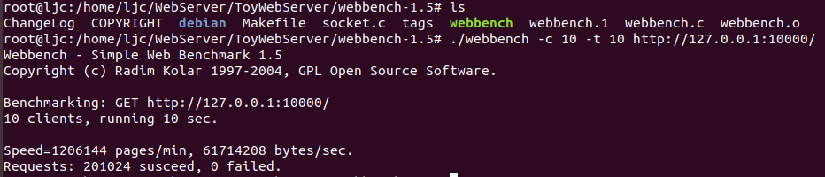
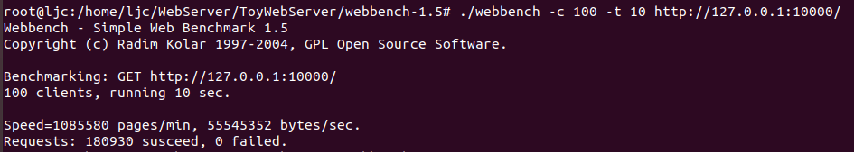

# 2022-7-20 完成基本功能 浏览器能够访问网页了
未完成的功能 ：
- 日志系统
- 定时检测非活动连接
- 数据库相关
  - 登录注册等

# 2022-7-20 完成基本功能后的第一次压测
>实验环境
> 
> 系统 : Ubuntu 18 (虚拟机)
> 内存 : 4G
> CPU : i5-11400H , 4核
 
**注意** `未注释std << cout 或者 printf!` 

~~~shell
./webbench -c 10 -t 10 http://127.0.0.1:10000/
# -c 指定并发量
# -t 指定测量时间
~~~

结果 ： 34000左右的QPS ,可能去掉 printf / cout 之类的会快一些吧

对比一下别人的看看，
[@IRVING-L](https://gitee.com/ljunsang/tiny-http-server)

15万...

> 去掉注释试一下！

12万，还是有点差距的

`编译器优化`从O1 -> O2

20万！！ 
看来编译器优化还是可以的。

并发从10到100:

18万，下降了。可能是，listenFdFlag = ET的原因？