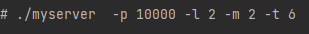

# 2022-7-20 完成基本功能 浏览器能够访问网页了
未完成的功能 ：
- 日志系统
- 定时检测非活动连接
- 数据库相关
  - 登录注册等

# 2022-7-20 完成基本功能后的第一次压测
>实验环境
> 
> 系统 : Ubuntu 18 (虚拟机)
> 内存 : 4G
> CPU : i5-11400H , 4核
 
**注意** `未注释std << cout 或者 printf!` 

~~~shell
./webbench -c 10 -t 10 http://127.0.0.1:10000/
# -c 指定并发量
# -t 指定测量时间
~~~

结果 ： 34000左右的QPS ,可能去掉 printf / cout 之类的会快一些吧

对比一下别人的看看，
[@IRVING-L](https://gitee.com/ljunsang/tiny-http-server)

15万...

> 去掉注释试一下！

12万，还是有点差距的

`编译器优化`从O1 -> O2

20万！！ 
看来编译器优化还是可以的。

并发从10到100:

18万，下降了。可能是，listenFdFlag = ET的原因？

# 2022-7-25 完成日志系统
又一个消费者生产者模型

顺便实现了个性化运行 ： 解析命令行参数并给server的各种参数赋值

# 2022-7-26 完成定时器后第一次压测
不开日志，不开定时功能，QPS 才只有 9万

开定时，不开日志 QPS 有 6万

开定时，开日志等级2 QPS 有 3 万 ... 好像差距有点大啊

对比@IRVING-L的，相同条件下有13万QPS

是不是日志那块出了问题 ？？

# 2022-7-27
关定时器开日志的QPS 依然3万左右

开定时器关日至的QPS 恢复到18万

确实是日志系统的问题，待解决

# 2022-7-27 14：43
> 以下所有测试的webbench参数 -c 10 -t 10

性能问题解决

。。。
原来的Log线程代码如下，我把while都给注释了，本来只想注释sleep来着

~~~cpp
void Log::logThreadFunc1(int num)
{
//    while (true)
//    {
//        sleep(3);
//        std::cout << "log thread" << num << "executing"<<std::endl;
        writeToFile();
//    }
}
~~~
把whilie循环注释回来就行了。

为什么呢？

因为该线程是消费者线程，将queuebuffer中的内容消耗掉，才能使得生产者继续往queue中添加数据。

而这里的日志是`同步模型`，当我们在webserver.cpp中调用DEBUG，而queue又满时，主线程就会被阻塞，进而大大减小QPS

> 可以开发一个异步日志模型？`尽量减少服务器主线程阻塞的可能`

在开日志，开定时器的情况下，QPS达到16万，算是可以了

sleep的影响？
把sleep也注释回来试一试。

| sleep秒数 | QPS |
|:-------:|:---:|
|    3    | 16万 |
|    2    | 17万 |
|    1    | 16万 |
|    0    | 16万 |

因该是不能得出啥普适性的结论了，应该看机器性能和负载情况了

未完成的功能 ： 登录以及数据库相关的东西

