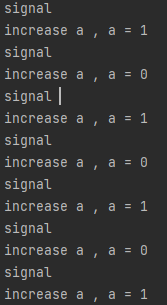

# 条件变量
为了实现thread_pool，首先封装锁类

打算使用条件变量，没有为什么，就是想试一试

具体代码见lock.h

测试代码如下 ：实现两个线程交替操作一个全局变量，使其再0 1之间切换

~~~cpp
//
// Created by 19269 on 2022/7/7.
//
#include <iostream>
#include "lock/lock.h"
#include <pthread.h>
int a = 0;
mutex mtx;
cond mcond;
void * work_increase(void *pVoid) {
    std::cout<<"work_increase\n";
    while(1) {
        mtx.lock();
        while(a == 1) {
            mcond.wait(mtx.getMutex());
        }
        a++;
        printf("increase a , a = %d \n",a);
        mcond.signal();
        mtx.unlock();
        printf("signal \n");
    }

}

void * word_decrease(void *pVoid) {
    std::cout<<"work_decrease\n";
    while(1) {
        mtx.lock();
        while(a == 0) {
            mcond.wait(mtx.getMutex());
        }
        a--;
        printf("increase a , a = %d \n",a);
        mcond.signal();
        mtx.unlock();
        printf("signal \n");
    }
}

int main() {
    pthread_t  t1, t2;
    pthread_create(&t1,NULL,work_increase, NULL);
    pthread_create(&t1,NULL,word_decrease, NULL);
    std::cout<<"main\n";
    while(1) {

    }
}
~~~
测试结果

> 有两点要注意
> - cond_wait() 要传入mutex,这是为了如果线程被阻塞，那么将mutex解锁，否则其他线程将不可能获得锁
> - 关键区要加入mutex保护，首先mutex.lock() 开启另一个循环时再mutex.unlock()

`推荐参考资料` ：
《操作系统导论》 30章 条件变量 p252